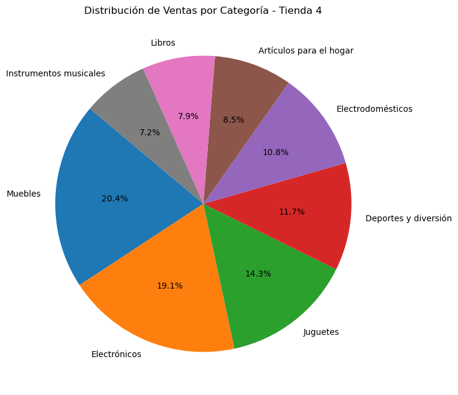

# 📊 Análisis de Rendimiento: Alura Store Challenge

Este proyecto presenta un análisis de datos exhaustivo para la cadena de tiendas **Alura Store**. El objetivo principal es asesorar al Sr. Juan sobre qué sucursal debería vender para capitalizar su próximo emprendimiento, basándose en el rendimiento comercial, la satisfacción del cliente y la eficiencia operativa.

## 🎯 Objetivo del Proyecto

Identificar la tienda menos eficiente de la cadena mediante el análisis de 4 datasets independientes, evaluando métricas críticas que permitan una toma de decisiones informada y estratégica.

## 📈 Métricas Analizadas

El análisis se centró en los siguientes pilares:
1.  **Ingresos Totales:** Volumen de ventas bruto por sucursal.
2.  **Satisfacción del Cliente:** Promedio de calificaciones recibidas.
3.  **Logística:** Costo de envío promedio por transacción.
4.  **Inventario:** Identificación de productos y categorías con mayor y menor rotación.
5.  **Distribución Geográfica:** Mapeo de ventas mediante coordenadas (latitud y longitud).

## 📊 Resumen Comparativo

| Métrica | Tienda 1 | Tienda 2 | Tienda 3 | Tienda 4 |
| :--- | :---: | :---: | :---: | :---: |
| **Ingresos Totales** | $1.150.880.000 | $1.116.344.000 | $1.098.020.000 | **$1.038.376.000** |
| **Calificación Media** | 3.97 | 4.03 | 4.04 | 3.99 |
| **Costo Envío Prom.** | $26.018 | $25.216 | $24.805 | $23.459 |
| **Estado** | Líder Ventas | Alta Fidelidad | Máxima Calidad | **Bajo Rendimiento** |

## 💡 Conclusión y Recomendación

Tras el análisis, se recomienda la **venta de la Tienda 4**. 

**Justificación:** A pesar de tener los costos de envío más bajos, la Tienda 4 es la sucursal con **menor generación de ingresos** (un 10% menos que la Tienda 1) y no presenta una ventaja competitiva en satisfacción al cliente que justifique su permanencia frente a las demás sedes. Su venta proporcionará el capital necesario para el nuevo proyecto del Sr. Juan con el menor impacto negativo en el flujo de caja global de la empresa.

## 🛠️ Tecnologías Utilizadas

* **Python 3.x**
* **Pandas:** Manipulación y limpieza de datos.
* **Matplotlib / Seaborn:** Visualización de datos y gráficos estadísticos.
* **Jupyter Notebook / Google Colab:** Entorno de desarrollo.

## 📂 Estructura del Repositorio

* `Challenge-Alura-Store.ipynb`: Notebook principal con todo el código de carga, limpieza, análisis y visualizaciones.
* `img/`: Gráficos crerados en el análisis.

## 📊 Visualizaciones Destacadas

### Distribución Geográfica de Ventas
Aquí se observa la concentración de ventas por ubicación, permitiendo identificar el alcance de cada tienda.

### Comparativa de Ingresos por Tienda
En este gráfico se hace evidente la brecha de ingresos de la Tienda 4 respecto a las demás.

### Distribución de Ventas por Categoría - Tienda 4

---
Proyecto desarrollado como parte del Challenge de Alura Store.
